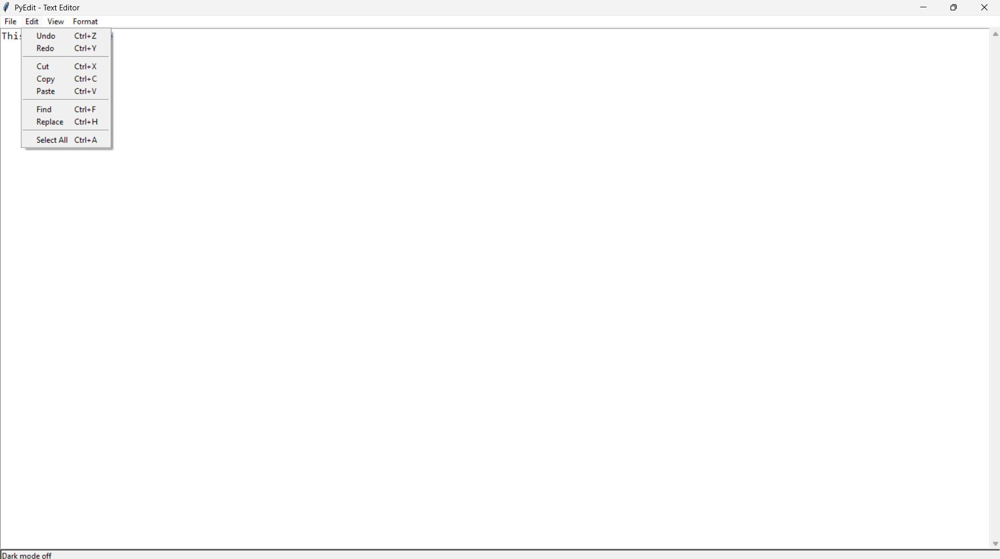
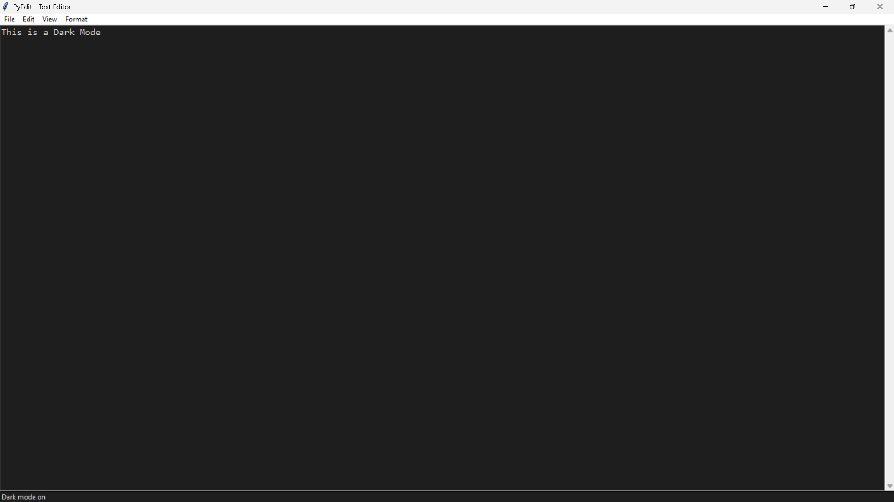
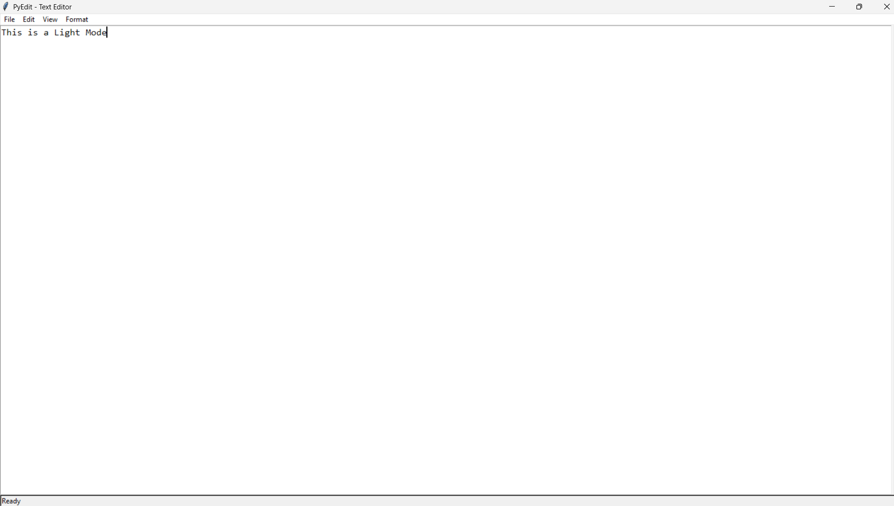

# PyEdit - Advanced Python Text Editor




A feature-rich text editor built with Python and Tkinter, with syntax highlighting, dark mode, and more.

## ✨ Features

- **Syntax Highlighting** (Python supported)
- **Dark/Light Mode** toggle
- **Find & Replace** with regex support
- **Auto-Save** functionality
- **Session Management** remembers your last file
- **Font Customization** (family + size)
- **Keyboard Shortcuts** for all common operations

## 🛠️ Installation

1. Ensure you have Python 3.8+ installed
2. Clone this repository:
   ```bash
   git clone https://github.com/yourusername/python-text-editor.git
   ```
3. Run the editor:
   ```bash
   cd python-text-editor
   python texteditor.py
   ```

## 🚀 Usage

```bash
python texteditor.py [filepath]  # Optional: Open a file directly
```

**Keyboard Shortcuts:**
- `Ctrl+N`: New file
- `Ctrl+O`: Open file
- `Ctrl+S`: Save
- `Ctrl+F`: Find
- `Ctrl+H`: Replace
- `Ctrl+A`: Select all

## 📦 Dependencies

Built-in Python modules only:
- `tkinter`
- `os`
- `json`
- `re`

## 📷 Screenshots
 
  


## 🤝 Contributing

Contributions welcome! Please:
1. Fork the project
2. Create a feature branch
3. Submit a Pull Request

## 📜 License

MIT License - Free for personal and commercial use